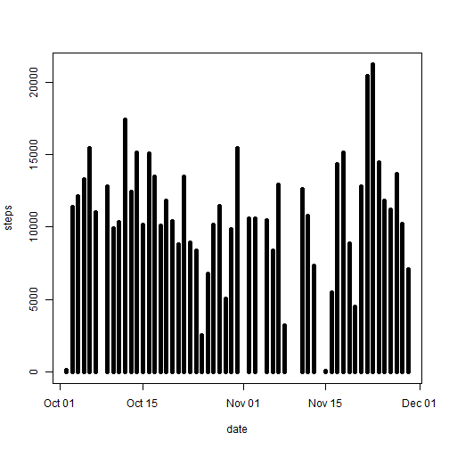
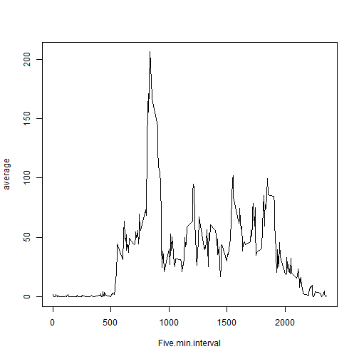
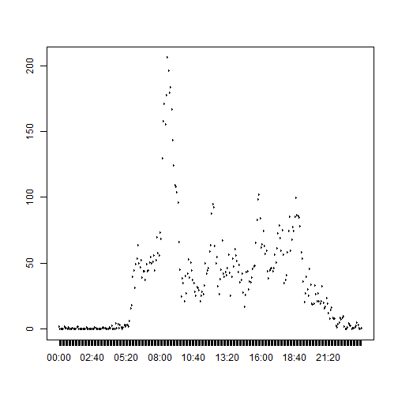
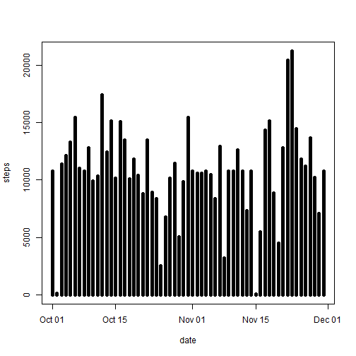
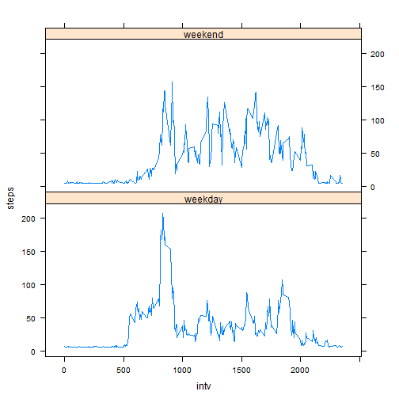

# Reproducible Research: Peer Assessment 1
## Loading and preprocessing the data

```r
library(lattice)
fnam = "activity.csv"
df <- read.table(fnam, header = TRUE, sep = ",", stringsAsFactors = FALSE)
df$date <- as.Date(df$date)
# get a data frame with no NAs for steps
dfclean <- df[!is.na(df$steps), ]
```


## What is mean total number of steps taken per day?

```r
subsum <- aggregate(dfclean[, 1], list(dfclean$date), sum)
names(subsum) <- c("date", "steps")
with(subsum, plot(date, steps, type = "h", lwd = 5))
```

 

```r
submean <- aggregate(dfclean[, 1], list(dfclean$date), mean)
# medians all zero because > half are zero
submedian <- aggregate(dfclean[, 1], list(dfclean$date), median)
```


## What is the average daily activity pattern?

```r
# want average, by 5 min period, for all days
sub5min <- aggregate(dfclean[, "steps"], list(dfclean$interval), mean)
names(sub5min) <- c("Five.min.interval", "average")
with(sub5min, plot(Five.min.interval, average, type = "l"))
```

 

```r

fmtint <- function(tint) {
    # get 5 char alpha
    temp <- as.character(10000 + tint)
    hrs <- substr(temp, 2, 3)
    mn <- substr(temp, 4, 5)
    ans = paste(hrs, mn, sep = ":")
}

sub5min$fmt5 <- fmtint(sub5min$Five.min.interval)
sub5min$fac <- factor(sub5min$fmt5)

with(sub5min, plot(fac, average, type = "l"))
```

 

```r
# Which interval contains max number of steps?
rownumber = which(sub5min$average == max(sub5min$average))
cat("Interval with max number of steps", sub5min$fmt5[rownumber], "\n")
```

```
## Interval with max number of steps 08:35
```


## Imputing missing values

```r
# Inputting missing values use original data to get rows with NAs
cat("Number of rows with NAs is: ", sum(!complete.cases(df)), "\n")
```

```
## Number of rows with NAs is:  2304
```

```r

# make dfplug be original data set with missing data filled in with
# estimates estimates will be average for given interval first, define a
# function to get the mean of steps for a given interval
getmean <- function(tint) {
    ans <- mean(df$steps[df$interval == tint], na.rm = TRUE)
    ans
}
dfplug <- df
dfplug[is.na(df$steps), "steps"] <- getmean(df$int)
# make a histogram what is mean total number of steps taken per day?
subsum2 <- aggregate(dfplug[, 1], list(dfplug$date), sum)
names(subsum2) <- c("date", "steps")
with(subsum2, plot(date, steps, type = "h", lwd = 5))
```

 

```r

# Report the mean and median
submean2 <- aggregate(dfplug[, 1], list(dfplug$date), mean)
# medians all zero because > half are zero
submedian2 <- aggregate(dfplug[, 1], list(dfplug$date), median)
dfboth <- submean2
dfboth$median <- submedian2$x
names(dfboth) <- c("date", "mean", "median")
print(dfboth)
```

```
##          date    mean median
## 1  2012-10-01 37.3826  37.38
## 2  2012-10-02  0.4375   0.00
## 3  2012-10-03 39.4167   0.00
## 4  2012-10-04 42.0694   0.00
## 5  2012-10-05 46.1597   0.00
## 6  2012-10-06 53.5417   0.00
## 7  2012-10-07 38.2465   0.00
## 8  2012-10-08 37.3826  37.38
## 9  2012-10-09 44.4826   0.00
## 10 2012-10-10 34.3750   0.00
## 11 2012-10-11 35.7778   0.00
## 12 2012-10-12 60.3542   0.00
## 13 2012-10-13 43.1458   0.00
## 14 2012-10-14 52.4236   0.00
## 15 2012-10-15 35.2049   0.00
## 16 2012-10-16 52.3750   0.00
## 17 2012-10-17 46.7083   0.00
## 18 2012-10-18 34.9167   0.00
## 19 2012-10-19 41.0729   0.00
## 20 2012-10-20 36.0938   0.00
## 21 2012-10-21 30.6285   0.00
## 22 2012-10-22 46.7361   0.00
## 23 2012-10-23 30.9653   0.00
## 24 2012-10-24 29.0104   0.00
## 25 2012-10-25  8.6528   0.00
## 26 2012-10-26 23.5347   0.00
## 27 2012-10-27 35.1354   0.00
## 28 2012-10-28 39.7847   0.00
## 29 2012-10-29 17.4236   0.00
## 30 2012-10-30 34.0938   0.00
## 31 2012-10-31 53.5208   0.00
## 32 2012-11-01 37.3826  37.38
## 33 2012-11-02 36.8056   0.00
## 34 2012-11-03 36.7049   0.00
## 35 2012-11-04 37.3826  37.38
## 36 2012-11-05 36.2465   0.00
## 37 2012-11-06 28.9375   0.00
## 38 2012-11-07 44.7326   0.00
## 39 2012-11-08 11.1771   0.00
## 40 2012-11-09 37.3826  37.38
## 41 2012-11-10 37.3826  37.38
## 42 2012-11-11 43.7778   0.00
## 43 2012-11-12 37.3785   0.00
## 44 2012-11-13 25.4722   0.00
## 45 2012-11-14 37.3826  37.38
## 46 2012-11-15  0.1424   0.00
## 47 2012-11-16 18.8924   0.00
## 48 2012-11-17 49.7882   0.00
## 49 2012-11-18 52.4653   0.00
## 50 2012-11-19 30.6979   0.00
## 51 2012-11-20 15.5278   0.00
## 52 2012-11-21 44.3993   0.00
## 53 2012-11-22 70.9271   0.00
## 54 2012-11-23 73.5903   0.00
## 55 2012-11-24 50.2708   0.00
## 56 2012-11-25 41.0903   0.00
## 57 2012-11-26 38.7569   0.00
## 58 2012-11-27 47.3819   0.00
## 59 2012-11-28 35.3576   0.00
## 60 2012-11-29 24.4688   0.00
## 61 2012-11-30 37.3826  37.38
```


## Are there differences in activity patterns between weekdays and weekends?

```r
# Use dfplug and add a field indicating whether weekday or weekend first,
# aggregate by interval

dfday <- dfplug
dfday$dow = "weekday"
Lweekend <- which((weekdays(dfday$date) == "Saturday") | (weekdays(dfday$date) == 
    "Sunday"))
dfday[Lweekend, "dow"] = "weekend"
dfday$dow <- factor(dfday$dow)
# need to aggregate by interval
dfdaysum <- aggregate(dfday$steps, list(dfday$interval, dfday$dow), mean)
names(dfdaysum) <- c("intv", "dow", "steps")

xyplot(steps ~ intv | dow, data = dfdaysum, type = "l", layout = c(1, 2))
```

 


